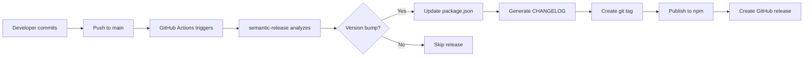

# Semantic Release Guide

> Automated versioning and publishing for `@advcomm/tenant_replication_postgres`

## 📋 Table of Contents

- [Overview](#overview)
- [How It Works](#how-it-works)
- [Commit Message Format](#commit-message-format)
- [Commit Types & Scopes](#commit-types--scopes)
- [Examples](#examples)
- [What Gets Published](#what-gets-published)
- [Manual Release](#manual-release)
- [Requirements](#requirements)
- [Troubleshooting](#troubleshooting)

---

## Overview

This package uses [semantic-release](https://semantic-release.gitbook.io/) for fully automated versioning and publishing to npm.

### Benefits

- ✅ **No manual version bumps** - Version is determined from commit messages
- ✅ **Automatic changelog** - Generated from commit history
- ✅ **Automatic publishing** - Pushed to npm when version changes
- ✅ **Automatic GitHub releases** - Created with release notes
- ✅ **Automatic git tags** - Created for each version

---

## How It Works



### Process Flow

1. **You commit** with a conventional commit message
2. **You push to main branch**
3. **GitHub Actions triggers** the release workflow
4. **semantic-release analyzes** your commits to determine version bump
5. **If version should change**, it automatically:
   - Updates `package.json` and `package-lock.json`
   - Generates `CHANGELOG.md`
   - Creates a Git tag
   - Publishes to npm
   - Creates a GitHub Release

---

## Commit Message Format

Follow the [Conventional Commits](https://www.conventionalcommits.org/) specification:

```
<type>(<scope>): <subject>

[optional body]

[optional footer(s)]
```

### Structure

- **Type** (required): What kind of change this is
- **Scope** (optional): What part of the codebase
- **Subject** (required): Short description of the change
- **Body** (optional): Detailed explanation
- **Footer** (optional): Breaking changes or issue references

---

## Commit Types & Scopes

### Commit Types

| Type | Version Bump | Description |
|------|--------------|-------------|
| `feat` | **Minor** | New feature |
| `fix` | **Patch** | Bug fix |
| `perf` | **Patch** | Performance improvement |
| `docs` | None | Documentation only |
| `style` | None | Code formatting |
| `refactor` | None | Code restructuring |
| `test` | None | Adding/modifying tests |
| `chore` | None | Build/config changes |
| `BREAKING CHANGE` | **Major** | Breaking change in footer |

### Scope (Optional)

Scope is optional but recommended for better organization:

| Scope | Example | Description |
|-------|---------|-------------|
| `mtdd` | `feat(mtdd): add caching` | MTDD routing features |
| `grpc` | `fix(grpc): resolve timeout` | gRPC communication |
| `api` | `feat(api): add endpoint` | API endpoint changes |
| `config` | `chore(config): update deps` | Configuration changes |

---

## Examples

### Patch Release (1.0.2 → 1.0.3)

```bash
# Bug fix
git commit -m "fix: resolve authentication issue"

# Performance improvement
git commit -m "perf: optimize database queries"

# Dependency update
git commit -m "chore: update dependency versions"
```

### Minor Release (1.0.2 → 1.1.0)

```bash
# New feature
git commit -m "feat: add user profile management"

# New feature with scope
git commit -m "feat(mtdd): implement caching layer"

# Feature with description
git commit -m "feat: add real-time notifications

- Implement Server-Sent Events endpoint
- Add Firebase push notification support
- Include device registration logic"
```

### Major Release (1.0.2 → 2.0.0)

```bash
# Breaking change with exclamation mark
git commit -m "feat!: change API interface
BREAKING CHANGE: .mtdd() method now requires tenantType parameter"

# Breaking change in footer
git commit -m "feat: redesign MTDD routing

BREAKING CHANGE: Remove deprecated routing methods

This commit removes the old routing API in favor of a new,
simpler interface."
```

### No Release Triggered

```bash
# Documentation only
git commit -m "docs: update README with examples"

# Code style
git commit -m "style: format code with Biome"

# Refactoring
git commit -m "refactor: extract constants to separate file"

# Tests only
git commit -m "test: add unit tests for query routing"

# Build/config
git commit -m "chore: update webpack configuration"
```

---

## What Gets Published

When a release is triggered, semantic-release automatically:

### 1. Package Version Update

```json
// package.json
{
  "version": "1.1.0"  // ← Automatically updated
}
```

### 2. CHANGELOG.md Generation

```markdown
# [1.1.0](https://github.com/advcomm/tenant_replication_postgres/compare/v1.0.2...v1.1.0) (2025-01-15)

## Features

* feat: add real-time notifications ([abc1234](https://github.com/advcomm/tenant_replication_postgres/commit/abc1234))
* feat(mtdd): implement caching layer ([def5678](https://github.com/advcomm/tenant_replication_postgres/commit/def5678))

## Bug Fixes

* fix: resolve authentication issue ([ghi9012](https://github.com/advcomm/tenant_replication_postgres/commit/ghi9012))
```

### 3. Git Tag Creation

```bash
git tag v1.1.0
```

### 4. NPM Publishing

```bash
npm publish @advcomm/tenant_replication_postgres@1.1.0
```

### 5. GitHub Release

- **Title**: `v1.1.0`
- **Description**: Auto-generated from CHANGELOG
- **Downloads**: Source code ZIP and tarball

---

## Manual Release

If you need to force a release, you can manually trigger the workflow:

### Via GitHub UI

1. Go to your repository on GitHub
2. Navigate to **Actions** tab
3. Find "Release Package" workflow
4. Click **Run workflow**
5. Select branch: `main`
6. Click **Run workflow**

### Via GitHub CLI

```bash
# Trigger workflow manually
gh workflow run "Release Package"
```

### Force a Specific Release

If you need to publish a specific version (e.g., hotfix):

```bash
# Create a commit that triggers the release type you want
git commit -m "fix: critical security patch"
git push origin main

# Or for a feature
git commit -m "feat: important feature"
git push origin main
```

---

## Requirements

### GitHub Secrets

Make sure these secrets are configured in your repository settings:

1. **Go to**: Settings → Secrets and variables → Actions
2. **Required secrets**:
   - `NPM_TOKEN` - Your npm authentication token

### NPM Authentication

1. **Create npm token**:
   ```bash
   npm login
   ```

2. **Get token**:
   - Go to npmjs.com → Access Tokens
   - Create new token (Classic) with **Publish** permission

3. **Add to GitHub**:
   - Repository → Settings → Secrets → Actions → New secret
   - Name: `NPM_TOKEN`
   - Value: Your npm token

### Commit Access

- You must have push access to `main` branch
- Commit messages must follow conventional commit format

---

## Troubleshooting

### No Release Triggered

**Symptom**: Pushed commits but no release happened.

**Solutions**:

1. **Check commit message format**:
   ```bash
   git log --oneline -5
   # Should see: feat: ..., fix: ..., etc.
   ```

2. **Verify latest commit is on main branch**:
   ```bash
   git branch --show-current
   # Should show: main
   ```

3. **Check GitHub Actions logs**:
   - Go to Actions tab
   - Click on the latest run
   - Check for semantic-release logs

4. **Commit types that don't trigger releases**:
   - `docs:`, `style:`, `refactor:`, `test:`, `chore:`

---

### Wrong Version Bumped

**Symptom**: Released v2.0.0 when you expected v1.1.0.

**Solutions**:

1. **Check commit history**:
   ```bash
   git log --oneline
   # Look for 'BREAKING CHANGE:' or 'feat!:'
   ```

2. **Review .releaserc.json**:
   ```bash
   cat .releaserc.json
   ```

3. **Check semantic-release analysis**:
   - GitHub Actions → Latest run → Check logs for version analysis

4. **Common mistakes**:
   - Using `feat!:` instead of `feat:` triggers major bump
   - Including `BREAKING CHANGE:` in footer triggers major bump
   - New features need `feat:` not `fix:`

---

### Workflow Failed

**Symptom**: GitHub Actions workflow fails.

**Solutions**:

1. **Check NPM_TOKEN**:
   ```bash
   # Verify secret exists
   gh secret list
   ```

2. **Check npm permissions**:
   - Verify you have publish access to `@advcomm/tenant_replication_postgres`
   - Check npm organization settings

3. **Check npm package exists**:
   ```bash
   npm view @advcomm/tenant_replication_postgres versions
   ```

4. **Common errors**:
   - "NPM_TOKEN secret not found" → Add secret to GitHub
   - "Version already published" → Version already exists on npm
   - "Permission denied" → Check npm organization permissions

---

### Can't Access Generated Files

**Symptom**: Can't find generated CHANGELOG.md or updated package.json.

**Reason**: These changes are committed automatically by the workflow.

**Solution**: Pull from main branch:
```bash
git pull origin main
```

---

## Best Practices

### 1. Write Clear Commit Messages

✅ **Good**:
```bash
git commit -m "feat(mtdd): add connection pooling for gRPC clients"
```

❌ **Bad**:
```bash
git commit -m "fixed stuff"
```

### 2. Use Scopes for Organization

✅ **Good**:
```bash
git commit -m "fix(grpc): resolve timeout issue"
git commit -m "feat(api): add user authentication endpoint"
```

❌ **Bad**:
```bash
git commit -m "fix: timeout issue"  # Which part of the codebase?
```

### 3. Document Breaking Changes

✅ **Good**:
```bash
git commit -m "feat!: redesign routing API

BREAKING CHANGE: .mtdd() method signature changed
Old: .mtdd(tenantId)
New: .mtdd(tenantId, tenantType)"
```

❌ **Bad**:
```bash
git commit -m "feat!: changed API"  # What changed?
```

### 4. Keep Commits Focused

✅ **Good**:
```bash
# Commit 1
git commit -m "feat: add caching layer"

# Commit 2
git commit -m "feat: add cache invalidation"
```

❌ **Bad**:
```bash
git commit -m "feat: add caching and refactor everything"  # Too much in one commit
```

---

## Configuration Files

### .github/workflows/release.yml

Workflow configuration for GitHub Actions.

```yaml
name: Release Package

on:
  push:
    branches:
      - main
  workflow_dispatch: # Allow manual trigger

jobs:
  release:
    runs-on: ubuntu-latest
    steps:
      # ... build and release steps
```

### .releaserc.json

Semantic-release plugin configuration.

```json
{
  "branches": ["main"],
  "plugins": [
    "@semantic-release/commit-analyzer",
    "@semantic-release/release-notes-generator",
    "@semantic-release/changelog",
    "@semantic-release/npm",
    "@semantic-release/git",
    "@semantic-release/github"
  ]
}
```

---

## Quick Reference

### Commit Type → Version Bump

```
feat → 1.0.0 → 1.1.0 (minor)
fix → 1.0.0 → 1.0.1 (patch)
feat! → 1.0.0 → 2.0.0 (major)
BREAKING CHANGE → 1.0.0 → 2.0.0 (major)
docs, style, refactor, test, chore → No release
```

### Common Commands

```bash
# Check last version
git describe --tags --abbrev=0

# View CHANGELOG
cat CHANGELOG.md

# View package version
npm view @advcomm/tenant_replication_postgres version

# List all versions
npm view @advcomm/tenant_replication_postgres versions
```

---

## Need Help?

- **GitHub Issues**: Report bugs and request features
- **Documentation**: Check main README.md for usage guide
- **semantic-release Docs**: https://semantic-release.gitbook.io/

---

**Happy releasing! 🚀**

